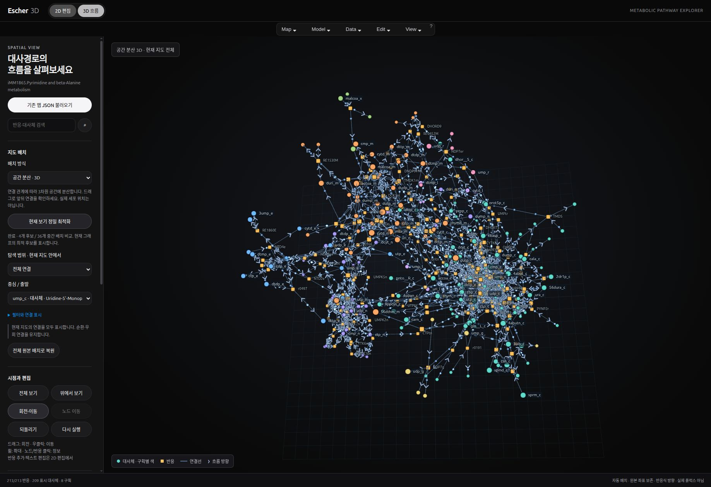

# Escher3D

**English** | [한국어](README.ko.md)

A local web app for editing Escher metabolic pathway maps and exploring reaction directions and supplied flux data in 3D.



## Getting started

Requires Node.js 18 or later. Browser libraries are bundled, so you can run the app without `npm install`.

```bash
git clone https://github.com/hpend2373/escher3d.git
cd escher3d
npm start
```

Open **http://127.0.0.1:4173/?map=merged** in your browser. Press `Ctrl+C` to stop the server.

If the port is already in use, choose another port:

```bash
node server.mjs --app-root app --port 4174 --open-path '/?map=merged'
```

You can also run `./Escher-iMM1865.sh` on macOS/Linux or `Escher-iMM1865.cmd` on Windows. These launchers choose an available port and open the browser.

## Features

- **2D editing:** Existing Escher editing, search, data import, and export.
- **3D layouts:** Original plane, compartment depth, layered pathways, radial layout, and spatial distribution.
- **Layout optimization:** Compares the current layout with three additional starting layouts and applies the result with a lower objective combining connection length, repulsion, and attraction to the center. Runs in a Web Worker with progress reporting and cancellation.
- **Pathway exploration:** View the full map, neighborhoods around selected items, or candidate routes between a source and a destination. Filter common cofactors and zero-flux reactions.
- **Flow visualization:** Direction arrows, moving particles, play/pause, speed control, and depth adjustment.
- **Collapsible settings:** Use the top-bar settings button to collapse or expand the left sidebar and give the 3D view more space. The demo card remains discoverable on every map and explains when an example map is required.
- **Demo highlights:** The four example maps automatically highlight selected presentation regions with red and blue edges and arrows, with matching larger moving particles and short fading trails; other flows use 60% of their normal opacity while highlights are enabled. Glycolysis/TCA/PPP also highlights TCA entry in yellow, and the tryptophan example adds a yellow melatonin synthesis region. Use the demo toggle to turn them off. These presets do not represent measured activity or biological importance; PNG exports retain the demo notice.
- **Export:** Map JSON, a PNG of the current 3D view, and separate 3D view JSON containing optimized coordinates and camera settings.

## Four public example pathways

In the app, click **기존 맵 JSON 불러오기** (Load existing map JSON) and select a file from `examples/`. The entire map is converted to 3D and automatically optimized.

| Example | Organism | Reactions | Unique metabolite IDs |
|---|---|---:|---:|
| [Glycolysis, TCA, and PPP](examples/RECON1.Glycolysis%20TCA%20PPP.json) | Human | 43 | 66 |
| [Tryptophan metabolism](examples/RECON1.Tryptophan%20metabolism.json) | Human | 45 | 82 |
| [Fatty acid beta-oxidation](examples/iJO1366.Fatty%20acid%20beta-oxidation.json) | E. coli | 46 | 59 |
| [Saturated fatty acid biosynthesis](examples/iJO1366.Fatty%20acid%20biosynthesis%20%28saturated%29.json) | E. coli | 54 | 57 |

These are unmodified maps downloaded from the official Escher server. Download URLs and SHA-256 hashes are recorded in [examples/sources.json](examples/sources.json); structural validation results are in [examples/validation.json](examples/validation.json). The examples use human RECON1 or E. coli iJO1366 identifiers and are separate from the default mouse iMM1865 model. Use a matching model for model-based analysis of each organism.

## Interpretation and scope

The default animation **visualizes reaction equation directions**. It does not represent measured or calculated cellular flux. When you load signed flux values for a single condition and select flux mode, negative values reverse the direction, while zero or missing values stop movement. The app does not infer flux from expression levels or two-condition comparisons.

3D coordinates are layouts for reading network connectivity, not physical positions within a cell. Optimization is a heuristic that compares multiple candidates; it does not guarantee a global optimum or eliminate overlaps from every viewing angle. Route exploration is limited to the current map. The app does not perform FBA, kinetic simulation, or atom tracing.

Automatic 3D layout does not overwrite the original 2D coordinates. **3D 보기 저장** (Save 3D view) and **맵 JSON 저장** (Save map JSON) produce separate files. Native Escher may fill in some missing curve control points when loading a map.

## Validation

```bash
npm test
```

The 22 checks cover reaction direction, signed flux, moving/undoing, route exploration, 3D structure within a single compartment, preservation of the original map, the optimization objective, and coordinate saving/restoration, demo target validity without changing source maps, and signed trail direction and boundary handling. The 3D view requires WebGL2; 2D editing remains available if graphics initialization fails.

## Project structure

- `app/`: Local browser app, data, Escher bundle, and Three.js.
- `app/escher-3d.js`, `app/escher-3d.css`: 3D rendering and UI.
- `app/scene-data.js`, `app/graph-layout.js`: Map conversion and route exploration.
- `app/spatial-layout.js`, `app/spatial-worker.js`: Layout and optimization.
- `examples/`: Four public pathways with source and validation records.
- `server.mjs`: Local server, bound to the loopback interface by default.
- `tests/`: Checks using the built-in Node.js test runner.

You can edit the extension code without a separate bundling step. `app/assets/` contains the compiled distribution assets of the existing Escher editor and preserves the original bundle.

## Sources and attribution

See [THIRD_PARTY_NOTICES.md](THIRD_PARTY_NOTICES.md). The source of the default iMM1865 model is documented in [docs/iMM1865-provenance.md](docs/iMM1865-provenance.md). [DESIGN.md](DESIGN.md) is the Framer style reference obtained through `getdesign`.

## Remote use

The default server binds to `127.0.0.1`. `Escher-Remote.sh` and `.cmd` are separate remote launchers that generate an access token. Remote HTTP connections do not include TLS, so use a trusted private network or an SSH tunnel. Do not commit generated access tokens to the repository.
